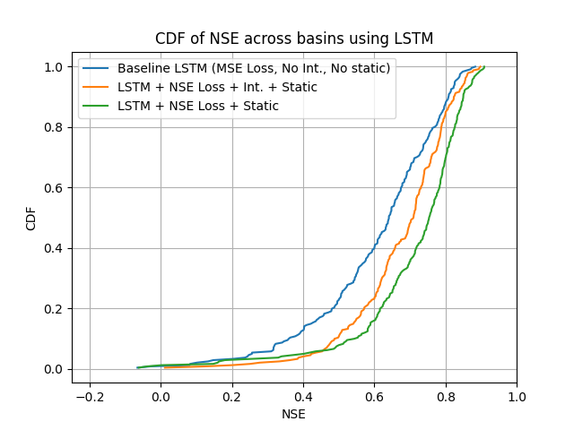

# Rainfall-runoff Modeling using Machine Learning
This project demonstrates using a LSTM and Transformer for rainfall-runoff modeling.

## Motivation
Using machine learning, specifically a long short-term memory (LSTM) network, for rainfall-runoff modeling was first popularized by [Kratzert et. al 2018](https://hess.copernicus.org/articles/22/6005/2018/), demonstrating that LSTMs achieve performance comparable to or better than the previously used conceptual models. Then, [Kratzert et. al 2019](https://hess.copernicus.org/articles/23/5089/2019/) further improved these results by adding basin-specific static features along with a much bigger model. Recently, transformers have also been popularized for modeling time-series data across a variety of applications, as demonstrated in [RR-Former](https://www.sciencedirect.com/science/article/abs/pii/S0022169422003560). This project aims to replicate these models on the CAMELS dataset.

## Data Loading
This project uses the [CAMELS](https://zenodo.org/records/15529996) dataset. To download the dataset, visit the URL, download `basin_timeseries_v1p2_metForcing_obsFlow.zip`, and extract the files from the zip.

The static features are created by downloading `camels_clim.txt`, `camels_geol.txt`, `camels_hydro.txt`, `camels_name.txt`, `camels_soil.txt`, `camels_topo.txt`, `camels_vege.txt`, and `gauge_information.txt` into `data/raw`. Then, run `data_code/clean_raw_data.py` to turn these text files into CSVs, then run `data_code/merge_files.py` to create `cleaned/merged_static_features.csv`. This CSV contains 27 static features that are also used in Kratzert et. al 2019. By adding these to every time step, the LSTM is able to use basin-specific features when making predictions, greatly improving performance.

To get the basin metadata, run `data_code/basin_metadata_download.py`. If you would like, you can then run `basin_map.py` to visualize the 673 basins across the United States in the entire CAMELS dataset.

## Models
### LSTM

An LSTM (Long Short-Term Memory) is a type of neural network designed to process sequences over time. It works by passing information step-by-step through the sequence while maintaining a hidden state and a memory (cell state). At each timestep, it decides what information to keep, what to forget, and what new information to add. This makes it very effective for problems where past context matters, such as rainfall–runoff modeling, where conditions from many days ago can still influence the present.

In the standard LSTM model, the entire input sequence is processed, but only the **final hidden state** is used to make a prediction. This means the model compresses all the information from the sequence into a single vector and outputs one value. While this works, it provides a relatively weak training signal because only one prediction is made per sequence.

The `LSTM_NSE` variant improves this by using **intermediate features**, meaning it produces a prediction at every timestep instead of just the final one. Rather than compressing the sequence into one output, the model outputs a sequence of predictions. This gives a much stronger training signal because the model is supervised at every timestep, helping it learn the temporal structure of the data more effectively.

---

### Transformer

A Transformer is a sequence model that replaces recurrence with **attention**. Instead of processing data step-by-step like an LSTM, it looks at the entire sequence at once and learns relationships between all timesteps simultaneously. This is done through self-attention, where each timestep can “attend” to other timesteps and decide which ones are important.

The model first projects the input into a higher-dimensional space and adds positional information so it knows the order of the sequence. It then passes the data through multiple layers, each consisting of attention and a feedforward network. Residual connections and normalization are used to stabilize training.

In this implementation, the Transformer processes the full sequence and then uses an **attention pooling layer** to combine all timesteps into a single representation before making a final prediction. Unlike the LSTM, it does not inherently model time step-by-step, but instead learns global relationships across the sequence, which can be powerful but also requires more careful design to work well for time-series problems like hydrology.

A HUC (Hydrologic Unit Code) is a system used to divide land into watershed regions based on how water flows rather than political boundaries like states or counties. Each HUC represents an area where precipitation drains into a common river system, stream network, or basin. In this project, HUCs are used to group basins with similar hydrological behavior, allowing models to be trained and evaluated on specific regions. This is important because factors like climate, soil, terrain, and snow patterns vary significantly across HUCs and strongly affect rainfall–runoff behavior.

## Training
**The transformer performs extremely bad on this dataset, so the overall focus of the training pipeline and results is on the LSTM. As a result, transformer details will be kept to a minimum** Furthermore, note that all training was completed on [Modal](https://modal.com/), a GPU cloud platform offering $30 per month in credits. It is perfectly fine to not use Modal, but this will then require creating new folders and changing some of the file paths in `train.py` to match your correct file paths.

Training is done
### Hyperparamters
The model-specific hyperparameters can be found under the "Transformer" comment and "LSTM" comment in the config in `training/train.py`. These parameters are the same as in the papers cited in the "Motivation" section above. They were all found using a hyperparameter search, meaning it's not recommended to change them. Next to all the various hyperparameters used for training is a comment describing what value to use to replicate the results in the various papers cited above.

Some of the non-intuitive but very important hyperparameters are `add_static_features` and `use_intermediate`. `add_static_features` describes whether or not you would like to add in the static features to every timestep, and `use_intermediate` describes whether or not you would like the model to produce predictions at every timestep in the sequence instead of only using the final timestep to make a single prediction.

Feel free to change `add_static_features`, `use_intermediate`, and `loss_function` to see how these parameters impact model performance. While Kratzert et. al 2019 trains on all the basins, doing this requires a lot of compute and is therefore not recommended. Furthermore, feel free to change the list of `hucs` to see how the model performs on different areas of the US. Different HUCs will lead to drastically differently results.

### Training
If you are using Modal, run `modal_train.py` to start training. Otherwise, run `train.py`.

Interestingly, when using intermediate features, validation NSE decreased as time went on. This was not the case when not using intermediate features.

## Results
An NSE CDF chart is used to evaluate model performance across many different basins by showing the distribution of Nash–Sutcliffe Efficiency (NSE) scores. NSE measures how well a model’s predicted streamflow matches the observed streamflow for each basin, where a value of 1 indicates perfect prediction, 0 means the model performs no better than simply using the average flow, and negative values indicate poor performance. The CDF (Cumulative Distribution Function) plots the percentage of basins that achieve an NSE less than or equal to a given value. This allows us to compare entire model performance distributions rather than only looking at the average. A curve that is shifted further to the right generally indicates better overall performance, since more basins achieve higher NSE values.

Next, we will create this chart for the various models that have been trained. To start, change the `folders_to_load_from` variable in `results/nse_cdf.py` to show which models you actually trained. Then, if you're using Modal, run `modal_nse_cdf.py` to load all the datasets and create this chart, otherwise run `nse_cdf.py`.

As demonstrated by the chart above, the model trained on static features with NSE loss performed the best, with the model trained on static features and intermediate features being a close second. The baseline model trained without static features and intermediate truth values and using MSE loss did not perform nearly as well as the other two models, demonstrating just how important static features are for rainfall-runoff modeling.